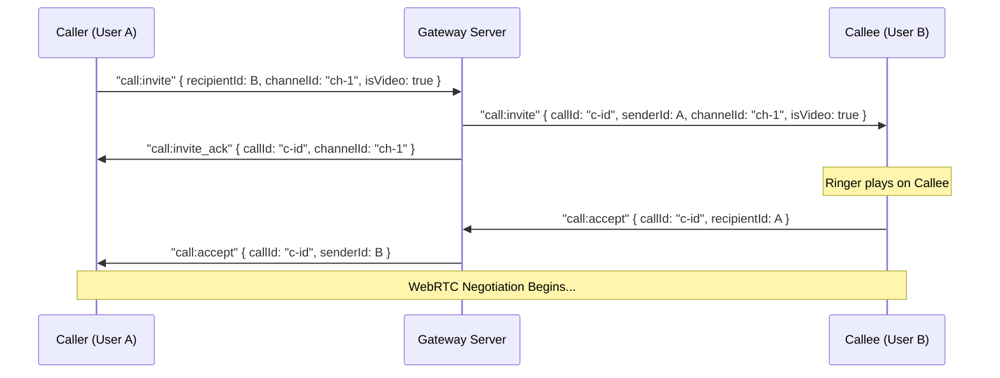

# Developer Integration Guide: Lotus Connect Chat & Signaling System

This document outlines the complete contract for communication between the Flutter client and the Axum (Rust) backend, detailing both REST API endpoints and real-time WebSocket protocol messages.

---

## 🗂️ 1. REST API Reference

All REST endpoints are prefixed with `/api/v1` and assume JSON request and response bodies unless otherwise specified.

### 🔐 Authentication

#### **Register User**
* **Endpoint**: `POST /auth/register`
* **Request Model**:
  ```json
  {
    "username": "johndoe",
    "email": "john@example.com",
    "password": "securepassword123",
    "fullName": "John Doe"
  }
  ```
* **Response Model** (200 OK / 201 Created):
  ```json
  {
    "accessToken": "eyJhbGciOi...",
    "refreshToken": "eyJhbGciOi...",
    "user": {
      "id": "019fb231-20c0-7cf1-84d5-dd053a261255",
      "username": "johndoe",
      "email": "john@example.com",
      "fullName": "John Doe",
      "avatarUrl": "http://localhost:8080/uploads/019fc877-c918-7241-94b2-298f26a57008-avatar.jpg"
    }
  }
  ```

#### **Login User**
* **Endpoint**: `POST /auth/login`
* **Request Model**:
  ```json
  {
    "username": "johndoe",
    "password": "securepassword123"
  }
  ```
* **Response Model** (200 OK): Same as Register User response.

---

### 👥 Friends & Contacts

#### **List Accepted Friends**
* **Endpoint**: `GET /users/friends`
* **Headers**: `Authorization: Bearer <access_token>`
* **Response Model** (200 OK):
  ```json
  [
    {
      "id": "019fa983-9f8c-7fc0-a285-fef0a8b88064",
      "username": "janedoe",
      "email": "jane@example.com",
      "fullName": "Jane Doe",
      "avatarUrl": "http://localhost:8080/uploads/019fa983-avatar.jpg"
    }
  ]
  ```

#### **Send Friend Request**
* **Endpoint**: `POST /users/friends`
* **Headers**: `Authorization: Bearer <access_token>`
* **Request Model**:
  ```json
  {
    "username": "janedoe"
  }
  ```
* **Response Model** (200 OK):
  ```json
  {
    "status": "success",
    "message": "Friend request sent successfully"
  }
  ```

#### **Accept Friend Request**
* **Endpoint**: `POST /users/friends/accept`
* **Headers**: `Authorization: Bearer <access_token>`
* **Request Model**:
  ```json
  {
    "friendId": "019fa983-9f8c-7fc0-a285-fef0a8b88064"
  }
  ```
* **Response Model** (200 OK):
  ```json
  {
    "success": true,
    "message": "Friend request accepted successfully"
  }
  ```

#### **Reject Pending Friend Request**
* **Endpoint**: `POST /users/friends/reject`
* **Headers**: `Authorization: Bearer <access_token>`
* **Request Model**:
  ```json
  {
    "friendId": "019fa983-9f8c-7fc0-a285-fef0a8b88064"
  }
  ```
* **Response Model** (200 OK):
  ```json
  {
    "success": true,
    "message": "Friend request rejected successfully"
  }
  ```

#### **Delete / Unfriend Friend**
* **Endpoint Option 1 (REST DELETE)**: `DELETE /users/friends/:friend_id`
* **Endpoint Option 2 (POST Remove)**: `POST /users/friends/remove`
* **Headers**: `Authorization: Bearer <access_token>`
* **Request Model (for Option 2)**:
  ```json
  {
    "friendId": "019fa983-9f8c-7fc0-a285-fef0a8b88064"
  }
  ```
* **Response Model** (200 OK):
  ```json
  {
    "success": true,
    "message": "Friend removed successfully"
  }
  ```

---

### 🔔 Notifications & Devices

#### **Get Notifications List**
* **Endpoint**: `GET /users/notifications`
* **Headers**: `Authorization: Bearer <access_token>`
* **Response Model** (200 OK):
  ```json
  [
    {
      "id": "019fb231-20c0-7cf1-84d5-dd053a261255",
      "user_id": "01a03314-af86-72f3-b270-d5642b05fbdc",
      "title": "New message from John Nguyen",
      "body": "Hello!",
      "data": null,
      "is_read": false,
      "created_at": "2026-09-03T10:00:00Z"
    }
  ]
  ```

#### **Mark All Notifications as Read**
* **Endpoint**: `POST /users/notifications/read`
* **Headers**: `Authorization: Bearer <access_token>`
* **Response Model** (200 OK):
  ```json
  {
    "success": true,
    "message": "Notifications marked as read"
  }
  ```

#### **Mark a Specific Notification as Read**
* **Endpoint**: `POST /users/notifications/:notification_id/read` *(or PATCH)*
* **Headers**: `Authorization: Bearer <access_token>`
* **Response Model** (200 OK):
  ```json
  {
    "success": true,
    "message": "Notification marked as read"
  }
  ```

#### **Delete a Specific Notification**
* **Endpoint**: `DELETE /users/notifications/:notification_id`
* **Headers**: `Authorization: Bearer <access_token>`
* **Response Model** (200 OK):
  ```json
  {
    "success": true,
    "message": "Notification deleted successfully"
  }
  ```
* **Error Responses**:
  - `401 Unauthorized`: Missing or invalid JWT
  - `404 Not Found`: Notification not found or does not belong to the authenticated user


#### **Register Device Token (Push Notifications)**
* **Endpoint**: `POST /users/devices` *(alias: `/users/device-token`)*
* **Headers**: `Authorization: Bearer <access_token>`
* **Request Model**:
  ```json
  {
    "token": "dUpAHTrbRfSwn_lEsvcYtI:APA91bGRt27bamAz02b-t_...",
    "platform": "ios"
  }
  ```
* **Response Model** (200 OK):
  ```json
  {
    "success": true,
    "message": "Device registered successfully"
  }
  ```

#### **Unregister Device Token**
* **Endpoint**: `POST /users/devices/unregister`
* **Headers**: `Authorization: Bearer <access_token>`
* **Request Model**:
  ```json
  {
    "token": "dUpAHTrbRfSwn_lEsvcYtI:APA91bGRt27bamAz02b-t_..."
  }
  ```
* **Response Model** (200 OK):
  ```json
  {
    "success": true,
    "message": "Device unregistered successfully"
  }
  ```

---

### 👤 User Profile & Avatar

#### **Get Current User Profile**
* **Endpoint**: `GET /users/me`
* **Headers**: `Authorization: Bearer <access_token>`
* **Response Model** (200 OK):
  ```json
  {
    "id": "019fb231-20c0-7cf1-84d5-dd053a261255",
    "username": "johndoe",
    "fullName": "John Doe",
    "email": "john@example.com",
    "avatarUrl": "http://localhost:8080/uploads/019fc877-c918-7241-94b2-298f26a57008-avatar.jpg",
    "friendshipStatus": null,
    "friendshipSenderId": null
  }
  ```

#### **Upload Avatar (Multipart)**
Uploads an image file for the current user's profile avatar. Supported formats include `jpg`, `jpeg`, `png`, `webp`, and `gif` (max 10MB).
* **Endpoint**: `POST /users/avatar` *(aliases: `POST /users/me/avatar`, `POST /upload/avatar`, `POST /uploads/avatar`)*
* **Headers**: `Authorization: Bearer <access_token>`, `Content-Type: multipart/form-data`
* **Form-data**: `avatar: <binary>` or `file: <binary>`
* **Response Model** (200 OK):
  ```json
  {
    "avatarUrl": "http://localhost:8080/uploads/019fc877-c918-7241-94b2-298f26a57008-avatar.jpg",
    "fileUrl": "http://localhost:8080/uploads/019fc877-c918-7241-94b2-298f26a57008-avatar.jpg",
    "user": {
      "id": "019fb231-20c0-7cf1-84d5-dd053a261255",
      "username": "johndoe",
      "fullName": "John Doe",
      "email": "john@example.com",
      "avatarUrl": "http://localhost:8080/uploads/019fc877-c918-7241-94b2-298f26a57008-avatar.jpg"
    }
  }
  ```

#### **Update Avatar URL (JSON)**
Sets or updates the current user's avatar URL using an already-uploaded file URL.
* **Endpoint**: `PUT /users/avatar` *(or `PATCH /users/avatar`, aliases: `/users/me/avatar`)*
* **Headers**: `Authorization: Bearer <access_token>`, `Content-Type: application/json`
* **Request Model**:
  ```json
  {
    "avatarUrl": "http://localhost:8080/uploads/019fc877-c918-7241-94b2-298f26a57008-avatar.jpg"
  }
  ```
* **Response Model** (200 OK): Same as Upload Avatar response.

---

### 📁 Media & File Uploads

#### **Upload Single File**
* **Endpoint**: `POST /api/v1/uploads` (or `POST /api/v1/upload`)
* **Headers**: `Authorization: Bearer <access_token>`, `Content-Type: multipart/form-data`
* **Form-data**: `file: <binary>`
* **Response Model** (200 OK):
  ```json
  {
    "fileUrl": "http://localhost:8080/uploads/019fc877-c918-7241-94b2-298f26a57008-recording.m4a"
  }
  ```

#### **Upload Multiple Files (Batch)**
* **Endpoint**: `POST /api/v1/uploads/multiple` (or `POST /api/v1/upload/multiple`)
* **Headers**: `Authorization: Bearer <access_token>`, `Content-Type: multipart/form-data`
* **Form-data**: Multiple file fields (`files`, `files[]`, or `file1`, `file2`)
* **Response Model** (200 OK):
  ```json
  {
    "files": [
      {
        "url": "http://localhost:8080/uploads/01a070af-cb79-7cc2-8395-4e64faddceea-photo1.jpg",
        "fileName": "photo1.jpg",
        "fileSize": 1542000,
        "mimeType": "image/jpeg"
      },
      {
        "url": "http://localhost:8080/uploads/01a070af-cb79-7cc2-8395-4e7054870ba4-photo2.jpg",
        "fileName": "photo2.jpg",
        "fileSize": 1820000,
        "mimeType": "image/jpeg"
      }
    ],
    "fileUrls": [
      "http://localhost:8080/uploads/01a070af-cb79-7cc2-8395-4e64faddceea-photo1.jpg",
      "http://localhost:8080/uploads/01a070af-cb79-7cc2-8395-4e7054870ba4-photo2.jpg"
    ]
  }
  ```

---

### 💬 Chats & Private Messaging

#### **Create Private Chat Conversation**
* **Endpoint**: `POST /chats/private`
* **Headers**: `Authorization: Bearer <access_token>`
* **Request Model**:
  ```json
  {
    "friendId": "019fa983-9f8c-7fc0-a285-fef0a8b88064"
  }
  ```
* **Response Model** (200 OK):
  ```json
  {
    "id": "019fc863-2500-7012-bcb9-dc61cef4c8e1",
    "title": "Jane Doe",
    "isUserToUser": true,
    "peerId": "019fa983-9f8c-7fc0-a285-fef0a8b88064",
    "createdAt": "2026-08-09T12:00:00Z"
  }
  ```

#### **Get Messages (with cursor-based pagination)**
* **Endpoint**: `GET /api/v1/chats/:conversation_id/messages`
* **Headers**: `Authorization: Bearer <access_token>`
* **Query Parameters**:
  * `cursor`: Message ID cursor for loading older messages (optional)
  * `limit`: Number of messages per page (optional, default: 25, max: 100)
* **Response Model** (200 OK, ordered chronologically ascending `created_at ASC`):
  ```json
  [
    {
      "id": "019fc863-0b31-7c43-bfb6-81f8133eacb4",
      "conversation_id": "019fc863-2500-7012-bcb9-dc61cef4c8e1",
      "sender_id": "019fb231-20c0-7cf1-84d5-dd053a261255",
      "content": "Vacation photos",
      "message_type": "image",
      "reply_to_id": null,
      "media_url": "http://localhost:8080/uploads/img-1.jpg",
      "thumbnail_url": "http://localhost:8080/uploads/img-1-thumb.jpg",
      "file_name": "photo1.jpg",
      "file_size": 1542000,
      "mime_type": "image/jpeg",
      "duration": null,
      "media_items": [
        {
          "url": "http://localhost:8080/uploads/img-1.jpg",
          "thumbnailUrl": "http://localhost:8080/uploads/img-1-thumb.jpg",
          "fileName": "photo1.jpg",
          "fileSize": 1542000,
          "mimeType": "image/jpeg",
          "duration": null,
          "width": 1080,
          "height": 720
        },
        {
          "url": "http://localhost:8080/uploads/img-2.jpg",
          "thumbnailUrl": "http://localhost:8080/uploads/img-2-thumb.jpg",
          "fileName": "photo2.jpg",
          "fileSize": 1820000,
          "mimeType": "image/jpeg",
          "duration": null,
          "width": 1080,
          "height": 720
        }
      ],
      "is_edited": false,
      "created_at": "2026-08-09T12:01:00Z",
      "updated_at": "2026-08-09T12:01:00Z",
      "reactions": [
        {
          "reaction": "👍",
          "count": 1,
          "users": ["019fb231-20c0-7cf1-84d5-dd053a261255"]
        }
      ]
    }
  ]
  ```

#### **Send Message (Text, Voice, or Multi-Media)**
* **Endpoint**: `POST /api/v1/chats/:conversation_id/messages`
* **Headers**: `Authorization: Bearer <access_token>`, `Content-Type: application/json`
* **Request Model (Multi-Image / Multi-Media)**:
  ```json
  {
    "content": "Trip photos",
    "messageType": "image",
    "mediaItems": [
      {
        "url": "http://localhost:8080/uploads/img-1.jpg",
        "thumbnailUrl": "http://localhost:8080/uploads/img-1-thumb.jpg",
        "fileName": "photo1.jpg",
        "fileSize": 1542000,
        "mimeType": "image/jpeg",
        "width": 1080,
        "height": 720
      },
      {
        "url": "http://localhost:8080/uploads/img-2.jpg",
        "thumbnailUrl": "http://localhost:8080/uploads/img-2-thumb.jpg",
        "fileName": "photo2.jpg",
        "fileSize": 1820000,
        "mimeType": "image/jpeg",
        "width": 1080,
        "height": 720
      }
    ]
  }
  ```
* **Response Model** (200 OK): Same as message object with `media_items` populated.


#### **Edit Message**
* **Endpoint**: `PUT /chats/messages/:message_id`
* **Headers**: `Authorization: Bearer <access_token>`
* **Request Model**:
  ```json
  {
    "content": "Hello Jane, how are you doing today?"
  }
  ```
* **Response Model** (200 OK):
  ```json
  {
    "id": "019fc863-0b31-7c43-bfb6-81f8133eacb4",
    "conversationId": "019fc863-2500-7012-bcb9-dc61cef4c8e1",
    "senderId": "019fb231-20c0-7cf1-84d5-dd053a261255",
    "content": "Hello Jane, how are you doing today?",
    "replyToId": null,
    "createdAt": "2026-08-09T12:01:00Z",
    "updatedAt": "2026-08-09T12:05:00Z"
  }
  ```

#### **Delete Message**
* **Endpoint**: `DELETE /chats/messages/:message_id`
* **Headers**: `Authorization: Bearer <access_token>`
* **Response Model** (200 OK):
  ```json
  {
    "status": "success"
  }
  ```

---

### 📞 Call History

#### **Get Call History List**
* **Endpoint**: `GET /calls/history`
* **Headers**: `Authorization: Bearer <access_token>`
* **Response Model** (200 OK):
  ```json
  [
    {
      "id": "019fce92-411a-7b3f-b883-fae431debcab",
      "callerId": "019fb231-20c0-7cf1-84d5-dd053a261255",
      "conversationId": "019fc863-2500-7012-bcb9-dc61cef4c8e1",
      "channelId": "call-session-987",
      "isVideo": true,
      "status": "completed",
      "createdAt": "2026-08-09T10:00:00Z",
      "duration": 180
    }
  ]
---

### 📰 Social Feed & Posts

The Social Feed API powers Facebook and Instagram-style social interactions, including multi-media rich posts, personalized timelines (friends + own posts), global explore discovery, emoji reactions, and nested comment threads.

All endpoints require `Authorization: Bearer <access_token>`.

#### **1. Create Post**
* **Endpoint**: `POST /posts`
* **Headers**: `Authorization: Bearer <access_token>`
* **Request Model**:
  ```json
  {
    "content": "Exploring the serene beauty of the countryside! 🌿✨ #travel #nature",
    "mediaItems": [
      {
        "url": "http://localhost:8080/uploads/019fd520-a75b-7589-9807-6bb9fdf7e3a9-photo.jpg",
        "mimeType": "image/jpeg",
        "width": 1080,
        "height": 1350
      },
      {
        "url": "http://localhost:8080/uploads/019fd521-b85c-7590-9908-7cc0fef8e4ba-video.mp4",
        "thumbnailUrl": "http://localhost:8080/uploads/019fd521-thumb.jpg",
        "mimeType": "video/mp4",
        "duration": 45
      }
    ],
    "visibility": "public" // 'public', 'friends', or 'private' (default: 'public')
  }
  ```
* **Response Model** (200 OK):
  ```json
  {
    "id": "019fd530-8a12-70b1-8b01-f2d47e8e29ba",
    "author": {
      "id": "019fb231-20c0-7cf1-84d5-dd053a261255",
      "username": "johndoe",
      "fullName": "John Doe",
      "avatarUrl": "http://localhost:8080/uploads/avatar.jpg"
    },
    "content": "Exploring the serene beauty of the countryside! 🌿✨ #travel #nature",
    "mediaItems": [
      {
        "url": "http://localhost:8080/uploads/019fd520-a75b-7589-9807-6bb9fdf7e3a9-photo.jpg",
        "mimeType": "image/jpeg",
        "width": 1080,
        "height": 1350
      }
    ],
    "visibility": "public",
    "likeCount": 0,
    "commentCount": 0,
    "userHasLiked": false,
    "userReaction": null,
    "createdAt": "2026-09-18T14:30:00Z",
    "updatedAt": "2026-09-18T14:30:00Z"
  }
  ```

#### **2. Get Post Details**
* **Endpoint**: `GET /posts/:post_id`
* **Headers**: `Authorization: Bearer <access_token>`
* **Response Model** (200 OK): Returns `PostResponse` object (same as Create Post).

#### **3. Update Post**
* **Endpoint**: `PUT /posts/:post_id` *(or `PATCH /posts/:post_id`)*
* **Headers**: `Authorization: Bearer <access_token>`
* **Request Model**:
  ```json
  {
    "content": "Updated caption for the post! 🌸",
    "visibility": "friends"
  }
  ```
* **Response Model** (200 OK): Returns updated `PostResponse`.

#### **4. Delete Post**
* **Endpoint**: `DELETE /posts/:post_id`
* **Headers**: `Authorization: Bearer <access_token>`
* **Response Model** (200 OK):
  ```json
  {
    "success": true,
    "message": "Post deleted successfully"
  }
  ```

#### **5. Get Home Feed (Personalized Timeline)**
Returns posts from the authenticated user, their accepted friends, and public posts, ordered by newest first with cursor-based pagination.
* **Endpoint**: `GET /feed?cursor=<post_uuid>&limit=<limit>`
* **Headers**: `Authorization: Bearer <access_token>`
* **Query Parameters**:
  * `cursor` *(optional, UUID)*: The `id` of the last post loaded in the current page.
  * `limit` *(optional, integer)*: Default `20`, min `1`, max `50`.
* **Response Model** (200 OK): Array of `PostResponse` objects.

#### **6. Get Explore Feed (Global Discovery)**
Returns all public posts platform-wide, ideal for discovery (Instagram Explore style).
* **Endpoint**: `GET /feed/explore?cursor=<post_uuid>&limit=<limit>`
* **Headers**: `Authorization: Bearer <access_token>`
* **Response Model** (200 OK): Array of `PostResponse` objects.

#### **7. Get User Profile Feed**
Returns posts authored by a specific user. Visibility is automatically enforced based on the relationship with the viewer (self sees all, friends see public + friends, non-friends see public only).
* **Endpoint**: `GET /users/:user_id/posts?cursor=<post_uuid>&limit=<limit>`
* **Headers**: `Authorization: Bearer <access_token>`
* **Response Model** (200 OK): Array of `PostResponse` objects.

#### **8. Add / Toggle Post Reaction**
* **Endpoint**: `POST /posts/:post_id/reactions`
* **Headers**: `Authorization: Bearer <access_token>`
* **Request Model**:
  ```json
  {
    "reaction": "love" // 'like', 'love', 'haha', 'wow', 'sad', 'angry' (default: 'like')
  }
  ```
* **Response Model** (200 OK):
  ```json
  {
    "id": "019fd535-645b-7489-9801-112233445566",
    "postId": "019fd530-8a12-70b1-8b01-f2d47e8e29ba",
    "user": {
      "id": "019fb231-20c0-7cf1-84d5-dd053a261255",
      "username": "janedoe",
      "fullName": "Jane Doe",
      "avatarUrl": "http://localhost:8080/uploads/jane.jpg"
    },
    "reaction": "love",
    "createdAt": "2026-09-18T14:35:00Z"
  }
  ```

#### **9. Remove Post Reaction**
* **Endpoint**: `DELETE /posts/:post_id/reactions`
* **Headers**: `Authorization: Bearer <access_token>`
* **Response Model** (200 OK):
  ```json
  {
    "success": true,
    "message": "Reaction removed successfully"
  }
  ```

#### **10. List Post Reactions**
* **Endpoint**: `GET /posts/:post_id/reactions`
* **Headers**: `Authorization: Bearer <access_token>`
* **Response Model** (200 OK): Array of reaction detail objects.

#### **11. Add Comment (or Reply to Comment)**
* **Endpoint**: `POST /posts/:post_id/comments`
* **Headers**: `Authorization: Bearer <access_token>`
* **Request Model**:
  ```json
  {
    "content": "This looks incredible! Where was this taken?",
    "parentCommentId": null // Set to UUID of parent comment for threaded replies
  }
  ```
* **Response Model** (200 OK):
  ```json
  {
    "id": "019fd540-1234-7589-9807-aabbccddeeff",
    "postId": "019fd530-8a12-70b1-8b01-f2d47e8e29ba",
    "author": {
      "id": "019fa983-9f8c-7fc0-a285-fef0a8b88064",
      "username": "janedoe",
      "fullName": "Jane Doe",
      "avatarUrl": "http://localhost:8080/uploads/jane.jpg"
    },
    "parentCommentId": null,
    "content": "This looks incredible! Where was this taken?",
    "createdAt": "2026-09-18T14:40:00Z",
    "updatedAt": "2026-09-18T14:40:00Z"
  }
  ```

#### **12. Get Post Comments**
* **Endpoint**: `GET /posts/:post_id/comments`
* **Headers**: `Authorization: Bearer <access_token>`
* **Response Model** (200 OK): Array of `CommentResponse` objects ordered chronologically.

#### **13. Delete Comment**
* **Endpoint**: `DELETE /posts/:post_id/comments/:comment_id`
* **Headers**: `Authorization: Bearer <access_token>`
* **Response Model** (200 OK):
  ```json
  {
    "success": true,
    "message": "Comment deleted successfully"
  }
  ```

---

## 🔌 2. WebSocket Protocol Schema

WebSocket endpoints require query-parameter-based JWT authentication (`/ws?token=<token>`). WebSocket message envelopes use a consistent structure:

```json
{
  "event": "event_name",
  "payload": { ... }
}
```

### 📤 Client-to-Server Events

#### **Heartbeat (Online Presence)**
Keep-alive ping sent periodically by the client.
```json
{
  "event": "heartbeat",
  "payload": {}
}
```

#### **Chat Focus**
Informs the server that the user is currently viewing a specific conversation, preventing redundant push notifications.
```json
{
  "event": "chat:focus",
  "payload": {
    "conversationId": "019fc863-2500-7012-bcb9-dc61cef4c8e1"
  }
}
```

#### **Typing Indicator**
Broadcasting to peer that the user is typing.
```json
{
  "event": "typing",
  "payload": {
    "recipientId": "019fa983-9f8c-7fc0-a285-fef0a8b88064",
    "conversationId": "019fc863-2500-7012-bcb9-dc61cef4c8e1",
    "isTyping": true
  }
}
```

#### **Read Receipt**
Marks a message as read.
```json
{
  "event": "chat:read",
  "payload": {
    "messageId": "019fc863-0b31-7c43-bfb6-81f8133eacb4"
  }
}
```

---

### 📥 Server-to-Client Broadcast Events

#### **Real-Time Presence Updates (`presence:status`)**
Broadcasted to all friends when a user connects or disconnects.
```json
{
  "event": "presence:status",
  "payload": {
    "userId": "019fb231-20c0-7cf1-84d5-dd053a261255",
    "isOnline": true,
    "lastSeen": "2026-08-09T12:30:00Z"
  }
}
```

#### **New Message Delivery (`chat:message`)**
```json
{
  "event": "chat:message",
  "payload": {
    "id": "019fc863-0b31-7c43-bfb6-81f8133eacb4",
    "conversationId": "019fc863-2500-7012-bcb9-dc61cef4c8e1",
    "senderId": "019fb231-20c0-7cf1-84d5-dd053a261255",
    "content": "Hello Jane, how are you?",
    "replyToId": null,
    "createdAt": "2026-08-09T12:01:00Z"
  }
}
```

#### **Edit Real-Time Sync (`chat:edit`)**
```json
{
  "event": "chat:edit",
  "payload": {
    "messageId": "019fc863-0b31-7c43-bfb6-81f8133eacb4",
    "content": "Hello Jane, how are you doing today?",
    "isEdited": true
  }
}
```

#### **Message Deletion Real-Time Sync (`chat:delete`)**
```json
{
  "event": "chat:delete",
  "payload": {
    "messageId": "019fc863-0b31-7c43-bfb6-81f8133eacb4",
    "conversationId": "019fc863-2500-7012-bcb9-dc61cef4c8e1"
  }
}
```

---

## 📞 3. Call Signalling & WebRTC Protocol

Call connections use WebSocket message wrappers starting with `call:` or `signaling:`.

### Invite Flow



#### **1. Caller sends call invitation (`call:invite`)**
```json
{
  "event": "call:invite",
  "payload": {
    "recipientId": "019fa983-9f8c-7fc0-a285-fef0a8b88064",
    "channelId": "call-session-987",
    "isVideo": true,
    "conversationId": "019fc863-2500-7012-bcb9-dc61cef4c8e1"
  }
}
```

#### **2. Callee receives call invitation (`call:invite`)**
```json
{
  "event": "call:invite",
  "payload": {
    "callId": "019fce92-411a-7b3f-b883-fae431debcab",
    "senderId": "019fb231-20c0-7cf1-84d5-dd053a261255",
    "conversationId": "019fc863-2500-7012-bcb9-dc61cef4c8e1",
    "channelId": "call-session-987",
    "isVideo": true
  }
}
```

#### **3. Callee accepts call (`call:accept`)**
```json
{
  "event": "call:accept",
  "payload": {
    "callId": "019fce92-411a-7b3f-b883-fae431debcab",
    "recipientId": "019fb231-20c0-7cf1-84d5-dd053a261255"
  }
}
```

#### **4. Call ended (`call:ended`)**
```json
{
  "event": "call:ended",
  "payload": {
    "callId": "019fce92-411a-7b3f-b883-fae431debcab",
    "recipientId": "019fa983-9f8c-7fc0-a285-fef0a8b88064"
  }
}
```

#### **5. WebRTC Peer-to-Peer SDP/ICE Signalling**
All messages prefixed with `signaling:` are routed directly to the target recipient payload envelope. Examples:
* `signaling:offer`
* `signaling:answer`
* `signaling:candidate`

**Example: ICE Candidate Signalling Exchange**
```json
{
  "event": "signaling:candidate",
  "payload": {
    "recipientId": "019fa983-9f8c-7fc0-a285-fef0a8b88064",
    "candidate": "candidate:842130496 1 udp 16777215 192.168.1.50 54321 typ srflx raddr 10.0.0.1 rport 54321 ...",
    "sdpMLineIndex": 0,
    "sdpMid": "0"
  }
}
```
