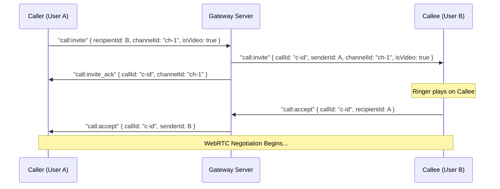

# Developer Integration Guide: Lotus Connect Chat & Signaling System

This document outlines the complete contract for communication between the Flutter client and the Axum (Rust) backend, detailing both REST API endpoints and real-time WebSocket protocol messages.

---

## 🗂️ 1. REST API Reference

All REST endpoints are prefixed with `/api/v1` and assume JSON request and response bodies unless otherwise specified.

### 🔐 Authentication

#### **Register User**
* **Endpoint**: `POST /auth/register`
* **Request Model**:
  ```json
  {
    "username": "johndoe",
    "email": "john@example.com",
    "password": "securepassword123",
    "fullName": "John Doe"
  }
  ```
* **Response Model** (200 OK / 201 Created):
  ```json
  {
    "accessToken": "eyJhbGciOi...",
    "refreshToken": "eyJhbGciOi...",
    "user": {
      "id": "019fb231-20c0-7cf1-84d5-dd053a261255",
      "username": "johndoe",
      "email": "john@example.com",
      "fullName": "John Doe"
    }
  }
  ```

#### **Login User**
* **Endpoint**: `POST /auth/login`
* **Request Model**:
  ```json
  {
    "username": "johndoe",
    "password": "securepassword123"
  }
  ```
* **Response Model** (200 OK): Same as Register User response.

---

### 👥 Friends & Contacts

#### **List Accepted Friends**
* **Endpoint**: `GET /users/friends`
* **Headers**: `Authorization: Bearer <access_token>`
* **Response Model** (200 OK):
  ```json
  [
    {
      "id": "019fa983-9f8c-7fc0-a285-fef0a8b88064",
      "username": "janedoe",
      "email": "jane@example.com",
      "fullName": "Jane Doe"
    }
  ]
  ```

#### **Send Friend Request**
* **Endpoint**: `POST /users/friends`
* **Headers**: `Authorization: Bearer <access_token>`
* **Request Model**:
  ```json
  {
    "username": "janedoe"
  }
  ```
* **Response Model** (200 OK):
  ```json
  {
    "status": "success",
    "message": "Friend request sent successfully"
  }
  ```

---

### 💬 Chats & Private Messaging

#### **Create Private Chat Conversation**
* **Endpoint**: `POST /chats/private`
* **Headers**: `Authorization: Bearer <access_token>`
* **Request Model**:
  ```json
  {
    "friendId": "019fa983-9f8c-7fc0-a285-fef0a8b88064"
  }
  ```
* **Response Model** (200 OK):
  ```json
  {
    "id": "019fc863-2500-7012-bcb9-dc61cef4c8e1",
    "title": "Jane Doe",
    "isUserToUser": true,
    "peerId": "019fa983-9f8c-7fc0-a285-fef0a8b88064",
    "createdAt": "2026-08-09T12:00:00Z"
  }
  ```

#### **Get Messages (with cursor pagination)**
* **Endpoint**: `GET /chats/:conversation_id/messages`
* **Headers**: `Authorization: Bearer <access_token>`
* **Query Parameters**:
  * `cursor`: Message ID cursor for next page (optional)
  * `limit`: Limit count per page (default: 20)
* **Response Model** (200 OK):
  ```json
  [
    {
      "id": "019fc863-0b31-7c43-bfb6-81f8133eacb4",
      "conversationId": "019fc863-2500-7012-bcb9-dc61cef4c8e1",
      "senderId": "019fb231-20c0-7cf1-84d5-dd053a261255",
      "content": "Hello Jane, how are you?",
      "replyToId": null,
      "createdAt": "2026-08-09T12:01:00Z"
    }
  ]
  ```

#### **Edit Message**
* **Endpoint**: `PUT /chats/messages/:message_id`
* **Headers**: `Authorization: Bearer <access_token>`
* **Request Model**:
  ```json
  {
    "content": "Hello Jane, how are you doing today?"
  }
  ```
* **Response Model** (200 OK):
  ```json
  {
    "id": "019fc863-0b31-7c43-bfb6-81f8133eacb4",
    "conversationId": "019fc863-2500-7012-bcb9-dc61cef4c8e1",
    "senderId": "019fb231-20c0-7cf1-84d5-dd053a261255",
    "content": "Hello Jane, how are you doing today?",
    "replyToId": null,
    "createdAt": "2026-08-09T12:01:00Z",
    "updatedAt": "2026-08-09T12:05:00Z"
  }
  ```

#### **Delete Message**
* **Endpoint**: `DELETE /chats/messages/:message_id`
* **Headers**: `Authorization: Bearer <access_token>`
* **Response Model** (200 OK):
  ```json
  {
    "status": "success"
  }
  ```

---

### 📞 Call History

#### **Get Call History List**
* **Endpoint**: `GET /calls/history`
* **Headers**: `Authorization: Bearer <access_token>`
* **Response Model** (200 OK):
  ```json
  [
    {
      "id": "019fce92-411a-7b3f-b883-fae431debcab",
      "callerId": "019fb231-20c0-7cf1-84d5-dd053a261255",
      "conversationId": "019fc863-2500-7012-bcb9-dc61cef4c8e1",
      "channelId": "call-session-987",
      "isVideo": true,
      "status": "completed",
      "createdAt": "2026-08-09T10:00:00Z",
      "duration": 180
    }
  ]
  ```

---

## 🔌 2. WebSocket Protocol Schema

WebSocket endpoints require query-parameter-based JWT authentication (`/ws?token=<token>`). WebSocket message envelopes use a consistent structure:

```json
{
  "event": "event_name",
  "payload": { ... }
}
```

### 📤 Client-to-Server Events

#### **Heartbeat (Online Presence)**
Keep-alive ping sent periodically by the client.
```json
{
  "event": "heartbeat",
  "payload": {}
}
```

#### **Chat Focus**
Informs the server that the user is currently viewing a specific conversation, preventing redundant push notifications.
```json
{
  "event": "chat:focus",
  "payload": {
    "conversationId": "019fc863-2500-7012-bcb9-dc61cef4c8e1"
  }
}
```

#### **Typing Indicator**
Broadcasting to peer that the user is typing.
```json
{
  "event": "typing",
  "payload": {
    "recipientId": "019fa983-9f8c-7fc0-a285-fef0a8b88064",
    "conversationId": "019fc863-2500-7012-bcb9-dc61cef4c8e1",
    "isTyping": true
  }
}
```

#### **Read Receipt**
Marks a message as read.
```json
{
  "event": "chat:read",
  "payload": {
    "messageId": "019fc863-0b31-7c43-bfb6-81f8133eacb4"
  }
}
```

---

### 📥 Server-to-Client Broadcast Events

#### **Real-Time Presence Updates (`presence:status`)**
Broadcasted to all friends when a user connects or disconnects.
```json
{
  "event": "presence:status",
  "payload": {
    "userId": "019fb231-20c0-7cf1-84d5-dd053a261255",
    "isOnline": true,
    "lastSeen": "2026-08-09T12:30:00Z"
  }
}
```

#### **New Message Delivery (`chat:message`)**
```json
{
  "event": "chat:message",
  "payload": {
    "id": "019fc863-0b31-7c43-bfb6-81f8133eacb4",
    "conversationId": "019fc863-2500-7012-bcb9-dc61cef4c8e1",
    "senderId": "019fb231-20c0-7cf1-84d5-dd053a261255",
    "content": "Hello Jane, how are you?",
    "replyToId": null,
    "createdAt": "2026-08-09T12:01:00Z"
  }
}
```

#### **Edit Real-Time Sync (`chat:edit`)**
```json
{
  "event": "chat:edit",
  "payload": {
    "messageId": "019fc863-0b31-7c43-bfb6-81f8133eacb4",
    "content": "Hello Jane, how are you doing today?",
    "isEdited": true
  }
}
```

#### **Message Deletion Real-Time Sync (`chat:delete`)**
```json
{
  "event": "chat:delete",
  "payload": {
    "messageId": "019fc863-0b31-7c43-bfb6-81f8133eacb4",
    "conversationId": "019fc863-2500-7012-bcb9-dc61cef4c8e1"
  }
}
```

---

## 📞 3. Call Signalling & WebRTC Protocol

Call connections use WebSocket message wrappers starting with `call:` or `signaling:`.

### Invite Flow



#### **1. Caller sends call invitation (`call:invite`)**
```json
{
  "event": "call:invite",
  "payload": {
    "recipientId": "019fa983-9f8c-7fc0-a285-fef0a8b88064",
    "channelId": "call-session-987",
    "isVideo": true,
    "conversationId": "019fc863-2500-7012-bcb9-dc61cef4c8e1"
  }
}
```

#### **2. Callee receives call invitation (`call:invite`)**
```json
{
  "event": "call:invite",
  "payload": {
    "callId": "019fce92-411a-7b3f-b883-fae431debcab",
    "senderId": "019fb231-20c0-7cf1-84d5-dd053a261255",
    "conversationId": "019fc863-2500-7012-bcb9-dc61cef4c8e1",
    "channelId": "call-session-987",
    "isVideo": true
  }
}
```

#### **3. Callee accepts call (`call:accept`)**
```json
{
  "event": "call:accept",
  "payload": {
    "callId": "019fce92-411a-7b3f-b883-fae431debcab",
    "recipientId": "019fb231-20c0-7cf1-84d5-dd053a261255"
  }
}
```

#### **4. Call ended (`call:ended`)**
```json
{
  "event": "call:ended",
  "payload": {
    "callId": "019fce92-411a-7b3f-b883-fae431debcab",
    "recipientId": "019fa983-9f8c-7fc0-a285-fef0a8b88064"
  }
}
```

#### **5. WebRTC Peer-to-Peer SDP/ICE Signalling**
All messages prefixed with `signaling:` are routed directly to the target recipient payload envelope. Examples:
* `signaling:offer`
* `signaling:answer`
* `signaling:candidate`

**Example: ICE Candidate Signalling Exchange**
```json
{
  "event": "signaling:candidate",
  "payload": {
    "recipientId": "019fa983-9f8c-7fc0-a285-fef0a8b88064",
    "candidate": "candidate:842130496 1 udp 16777215 192.168.1.50 54321 typ srflx raddr 10.0.0.1 rport 54321 ...",
    "sdpMLineIndex": 0,
    "sdpMid": "0"
  }
}
```

---

## 🖼️ 4. Media Uploads & Messages

Sending media messages is a two-step process: (1) uploading the file to obtain its remote URL, and (2) sending the message payload linking to that URL.

### **Step 1: Upload Media File**
* **Endpoint**: `POST /uploads`
* **Headers**: `Authorization: Bearer <access_token>`
* **Content-Type**: `multipart/form-data`
* **Request Body**:
  * Form field `file` containing binary file data.
* **Response Model** (200 OK):
  ```json
  {
    "fileUrl": "http://localhost:9000/lotus-connect-bucket/photo-178238.png"
  }
  ```

### **Step 2: Send Message with Media Attachment**
* **Endpoint**: `POST /chats/:conversation_id/messages`
* **Headers**: `Authorization: Bearer <access_token>`
* **Request Model**:
  ```json
  {
    "content": "Check out this image!",
    "messageType": "image",
    "mediaUrl": "http://localhost:9000/lotus-connect-bucket/photo-178238.png",
    "thumbnailUrl": "http://localhost:9000/lotus-connect-bucket/photo-178238.png",
    "fileName": "photo.png",
    "fileSize": 102400,
    "mimeType": "image/png"
  }
  ```
* **Response Model** (200 OK):
  ```json
  {
    "id": "019fc863-0b31-7c43-bfb6-81f8133eacb4",
    "conversationId": "019fc863-2500-7012-bcb9-dc61cef4c8e1",
    "senderId": "019fb231-20c0-7cf1-84d5-dd053a261255",
    "content": "Check out this image!",
    "mediaUrl": "http://localhost:9000/lotus-connect-bucket/photo-178238.png",
    "thumbnailUrl": "http://localhost:9000/lotus-connect-bucket/photo-178238.png",
    "fileName": "photo.png",
    "fileSize": 102400,
    "mimeType": "image/png",
    "createdAt": "2026-08-09T12:01:00Z"
  }
  ```

---

## 😃 5. Message Reactions

### **Add Reaction to Message**
* **Endpoint**: `POST /chats/messages/:message_id/reactions`
* **Headers**: `Authorization: Bearer <access_token>`
* **Request Model**:
  ```json
  {
    "reaction": "👍"
  }
  ```
* **Response Model** (200 OK):
  ```json
  {
    "messageId": "019fc863-0b31-7c43-bfb6-81f8133eacb4",
    "userId": "019fb231-20c0-7cf1-84d5-dd053a261255",
    "reaction": "👍",
    "createdAt": "2026-08-09T12:10:00Z"
  }
  ```

### **Remove Reaction from Message**
* **Endpoint**: `DELETE /chats/messages/:message_id/reactions/:reaction`
* **Headers**: `Authorization: Bearer <access_token>`
* **Response Model** (200 OK):
  ```json
  {
    "success": true,
    "message": "Reaction removed"
  }
  ```

### **Get Message Reactions List**
* **Endpoint**: `GET /chats/messages/:message_id/reactions`
* **Headers**: `Authorization: Bearer <access_token>`
* **Response Model** (200 OK):
  ```json
  [
    {
      "messageId": "019fc863-0b31-7c43-bfb6-81f8133eacb4",
      "userId": "019fb231-20c0-7cf1-84d5-dd053a261255",
      "reaction": "👍",
      "createdAt": "2026-08-09T12:10:00Z"
    }
  ]
  ```

